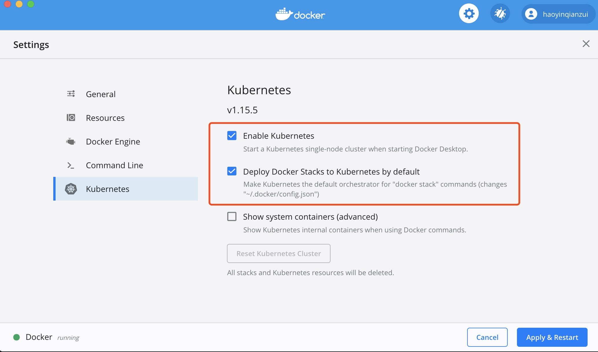

k8s，即Kubernetes，是一个全新的基于容器技术的分布式架构解决方案。因为肺炎宅在家，这个春节总算能好好系统的学习一下k8s。

<!-- more -->

## CentOS安装

首先需要关闭CentOS自带防火墙服务

```shell
systemctl disable firewalld
systemctl stop firewalld
```
然后安装etcd和k8s

```shell
yum install -y etcd kubernetes
```

按顺序启所有的k8s相关服务

```shell
systemctl start etcd
systemctl start docker
systemctl start kube-apiserver
systemctl start kube-controller-manager
systemctl start kube-scheduler
systemctl start kubelet
systemctl start kube-proxy
```

安装完成之后，可以查看下k8s版本

```shell
kubectl --version
#output Kubernetes v1.5.2
```

## Mac安装

1. 下载Docker for Mac App, [下载地址](https://docs.docker.com/docker-for-mac/install/)

2. 安装完毕后勾选Enable Kubernetes 及使用k8s作为默认的编排器


