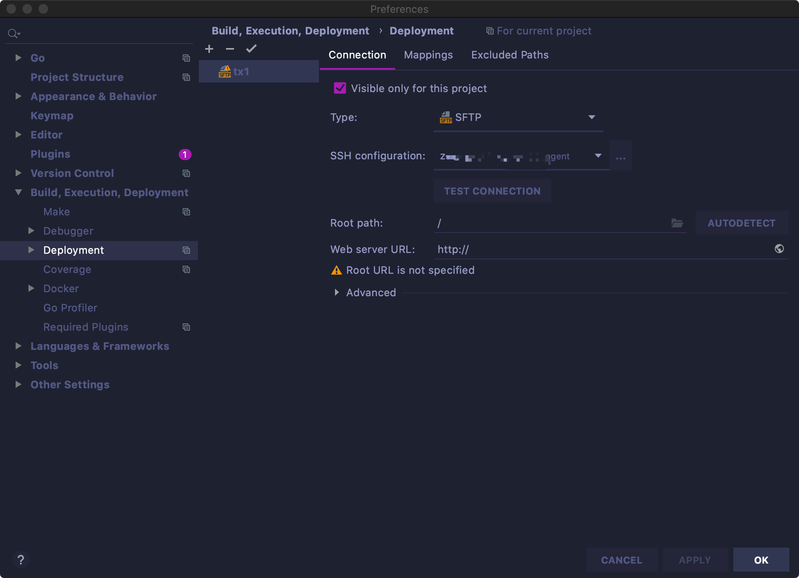
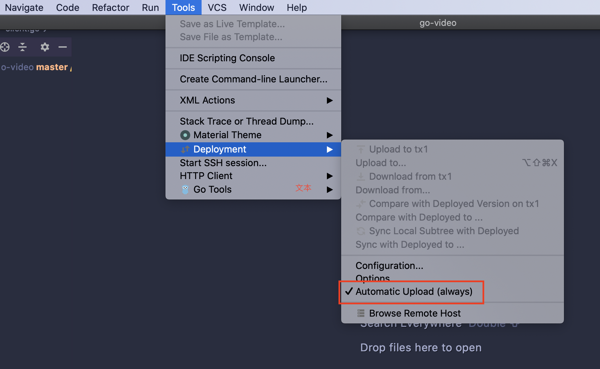
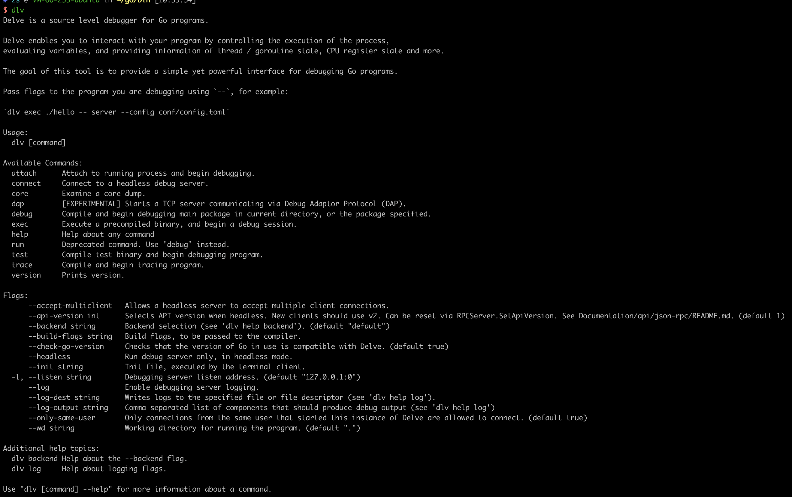
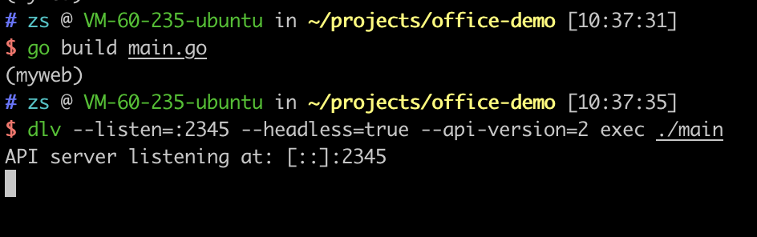
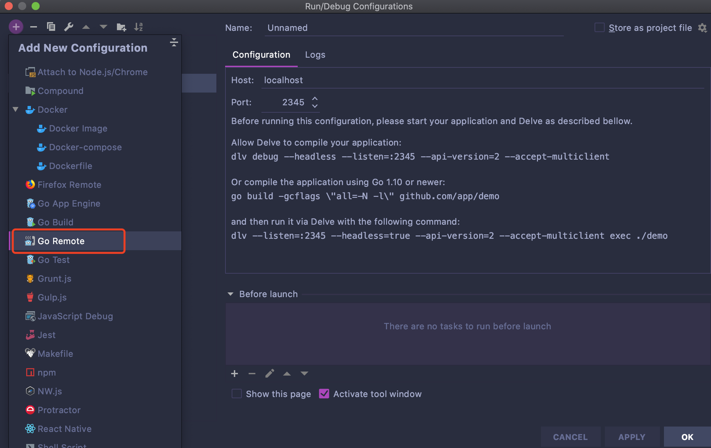

很多时候需要在服务器上进行调试，`goland`配合`golang`的`debug`工具`dlv`可以非常容易的实现远程开发调试。

<!-- more -->

## 1.配置sftp

### 首先我们需要实现代码的实时同步。

Goland菜单: Tools -> Deployment -> Configuration




### 配置本地目录与远端的映射

配置目录映射也非常简单


### 开启自动同步

开启自动同步后，`goland`会在`save`的时候自动同步远端




## 2.服务端安装Delve

注意需要确保执行命令的目录并非一个`go module`的目录

```shell
go get github.com/go-delve/delve/cmd/dlv
```

安装完成后，执行`dlv`查看结果



如果提示找不到此命令，则需要把`$GOPATH\bin`添加到`$PATH`

## 4.build and dlv

```
# 编译
go build main.go 

# 调试
dlv --listen=:2345 --headless=true --api-version=2 exec ./main
```



## 5.goland debug

Run -> Edit Configurations -> 点击左上角+号 -> Go Remote 



配置服务器的ip及端口，然后就能收到调试信息了