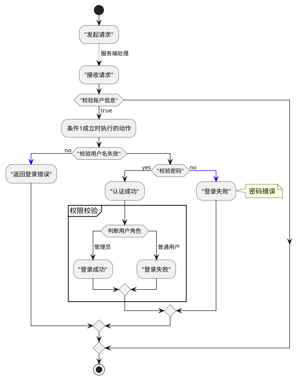
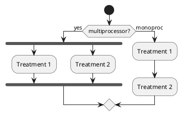
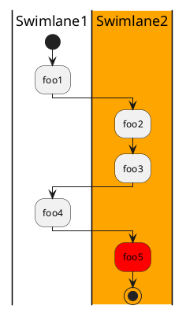

工作中经常需要画`UML`，`draw.io`是个非常好的可视化工具，对程序员来说`PlantUML`用编程的方式来画`UML`也是一个非常不错的选择。

<!-- more -->

## 时序图

我们来实现一个简单的用户登录token校验的时序图。参与者是不用显示声明的，`用户 -> 认证中心: 登录操作`，就表示`用户`向`认证中心`发起了`登录操作`。

```planuml
@startuml

skinparam responseMessageBelowArrow true /' response在箭头下方 '/
用户 -> 认证中心: 登录操作
activate 认证中心

认证中心 -> 认证中心: 账户校验 /' 给自己发消息，用\n换行 '/
认证中心 --> 用户: 校验失败
note right #FFAAAA: 账户信息校验失败

认证中心 -> 缓存: 存放token
note over 认证中心, 缓存: 账户信息校验成功

认证中心 -> 用户: 返回token
deactivate 认证中心

用户 -> 认证中心: 携带token再次访问
认证中心 -> 缓存: 获取用户token
缓存 -> 认证中心: 返回token
|||  /' 空间 '/
认证中心 -> 业务服务: 校验token成功跳转其它业务服务
@enduml
```

生成的`UML`图如下


可以用`participant`关键字声明参与者，声明也可以控制参与者的图标、颜色以及参与者之间顺序。

```planuml
@startuml
actor Bob #red
' actor 和 participant 只在外观上有区别
participant Alice
participant "很长很长很长\n的名字" as L #99FF99

Alice->Bob: 认证请求
Bob->Alice: 认证响应
Bob->L: 记录事务日志
@enduml
```


箭头还支持下面的设置

* ->,<-- 传递消息
* -->, <-- 虚线箭头
* -[#red]> 红色箭头
* ->x 打X
* x->o 
* <-> 双向信息

## 流程图

流程图支持常见的 `switch`、`if-else` 、`while`等逻辑处理。




可以使用关键字fork，fork again和end fork表示并行处理




## 泳道(Swimlanes)

泳道图是一种特殊的流程图。




## 主题

可以前往[PlantUML主题](https://github.com/future-architect/puml-themes)挑选一些喜欢的主题，使用也非常简单，在`startuml`之后添加一行即可。

> !include https://raw.githubusercontent.com/bschwarz/puml-themes/master/themes/bluegray/puml-theme-bluegray.puml

