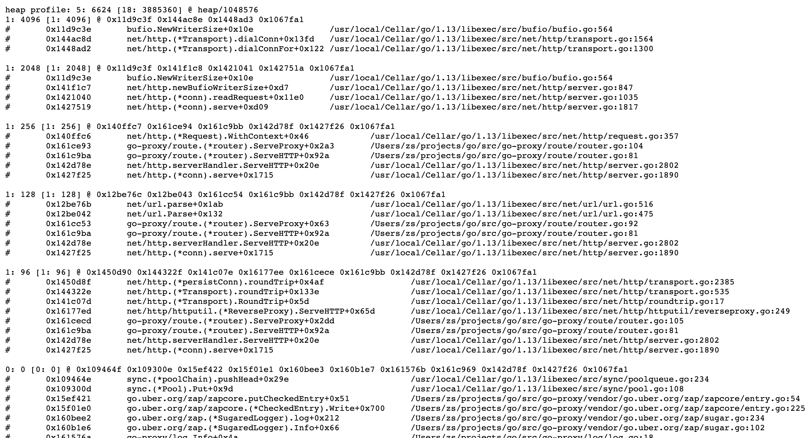

pprof是golang runtime内置的性能分析工具。

<!-- more -->


## 使用说明

pprof的使用只需要引入pprof包，然后在任意端口上启动http服务。

```golang
package main

import (
	"net/http"
	_ "net/http/pprof" // pprof debug
)

func main() {
	http.ListenAndServe(":8080", nil) // debug
}
```

程序启动后，我们在浏览器上打开`http://localhost:8080/debug/pprof/`, 可以看到如下界面说明pprof正常启动。


## CPU分析
首先采集 cpu 信息，有两种方式，web上点击`profile`链接获得profile文件，或者用 `go tool pprof`采集
```shell 
# 打开profile文件
go tool pprof /profile/file/path
#  采集30秒cpu信息
go tool pprof 'http://localhost:8080/debug/pprof/profile?seconds=30'
```

## 内存分析
浏览器打开`http://localhost:8080/debug/pprof/heap?debug=1`，可以看到 golang 程序实时的内存信息。从图第一行可以看出当前使用内存6KB。



我们可以使用 `go tool pprof` 查看更多信息。

```shell
# 已经分配的内存
go tool pprof -alloc_space http://localhost:8080/debug/pprof/heap
# 正在使用的内存
go tool pprof -inuse_space http://localhost:8080/debug/pprof/heap
```


## goroutine分析
浏览器打开`http://localhost:8080/debug/pprof/goroutine?debug=1`，可以看到 golang 程序实时的goroutine数量和调用信息。


打开`http://localhost:8080/debug/pprof/goroutine?debug=2`，可以看到`goroutine`更详细的信息。


